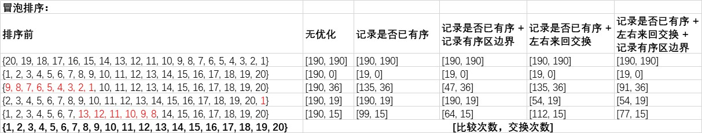

# 冒泡排序
有4种优化手段，分别是
- 记录是否已有序
- 记录是否已有序 + 记录有序区边界
- 记录是否已有序 + 左右来回交换
- 记录是否已有序 + 左右来回交换 + 记录有序区边界

其中左右来回交换又称为鸡尾酒排序  

[漫画：什么是冒泡排序？](https://mp.weixin.qq.com/s/tXqjWWyjQ1ILfvnFv3_f7Q)  
[漫画：什么是鸡尾酒排序？](https://mp.weixin.qq.com/s/tXqjWWyjQ1ILfvnFv3_f7Q)  
